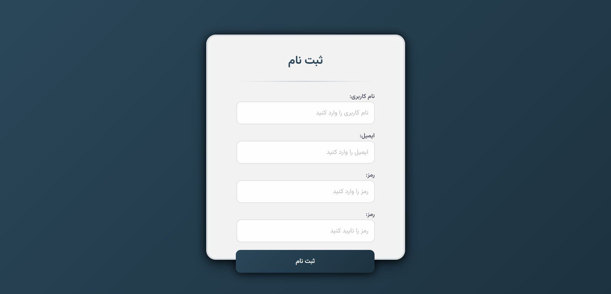

# 📝 Modern Registration Form

<div align="center">



[](LICENSE)

</div>

## 🚀 Live Demo

Experience the site live at 👉 [Click me](https://registration-form-emad.netlify.app/)

## ✨ Overview

A modern, responsive registration form with smooth animations and validation. Built with pure HTML, CSS, and JavaScript to provide an exceptional user experience.

## 🎯 Key Features

<details>
<summary><strong>💫 Responsive Design</strong></summary>

-   Fluid layouts for all devices
-   Clean and modern interface
-   Optimized for all screen sizes
-   Mobile-first approach
</details>

<details>
<summary><strong>🎨 Modern UI Elements</strong></summary>

-   Beautiful liquid glass effect
-   Enhanced contrast and readability
-   Smooth hover animations
-   Interactive form controls
-   Custom input styling
-   Light/Dark theme support
</details>

<details>
<summary><strong>🔒 Form Features</strong></summary>

-   User-friendly validation
-   Password confirmation
-   Error messaging system (Soon)
-   RTL language support
</details>

## 🛠️ Tech Stack

```plaintext
Frontend:
├── HTML5
├── ES6 (JavaScript)
└── CSS3

Fonts:
├── Vazirmatn
└── Poppins
```

## 📂 Project Structure

```plaintext
registration-form/
├── images/
│   └── screenshot.png
├── script/
│   ├── app.js
|   └── theme.js
├── style/
│   ├── main.css
│   └── theme.css
├── index.html
└── README.md
```

## ⚙️ Installation

```bash
# Clone repository
git clone https://github.com/emadn87/registration-form.git

# Navigate to project
cd registration-form

# Open in browser
# Simply open index.html in your preferred browser
```

## 🤝 Contributing

We welcome contributions! Here's how:

1. **Fork** the repository
2. Create a **feature branch**:
    ```bash
    git checkout -b feature/amazing-feature
    ```
3. **Commit** your changes:
    ```bash
    git commit -m 'Add amazing feature'
    ```
4. **Push** to your branch:
    ```bash
    git push origin feature/amazing-feature
    ```
5. Open a **Pull Request**

## 📝 License

This project is licensed under the MIT License - see the [LICENSE](LICENSE) file for details.

<div align="center">

**[⭐ Star this repo](https://github.com/emadn87/registration-form)** if you find it helpful!

</div>
